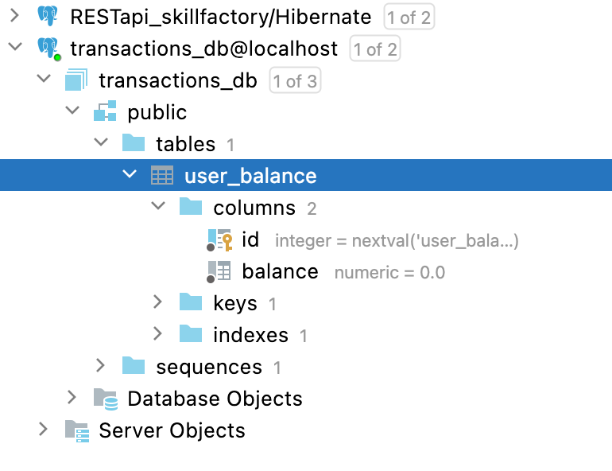

# Банковское приложение
## Структура проекта
### controller

`UserBalanceController` - REST Controller

### exception
`GlobalExceptionHandling` - класс, предоставляющий функциональность Global Exception Handler-a 
`IncorrectData` - тип объекта, который добавляется в HTTP Response Body 
`NoSuchElementException` - exception, на который должен реагировать метод 
`NotEnoughMiney` - exception, на который должен реагировать метод

### model
`UserBalance` - pojo-класс, отображающий таблицу БД

### repository
`UserBalanceRepository` - слой DAO, для взаимодействия с БД

#### application.property
Файл для хранения параметров конфигурации приложения 
#### Структура БД

